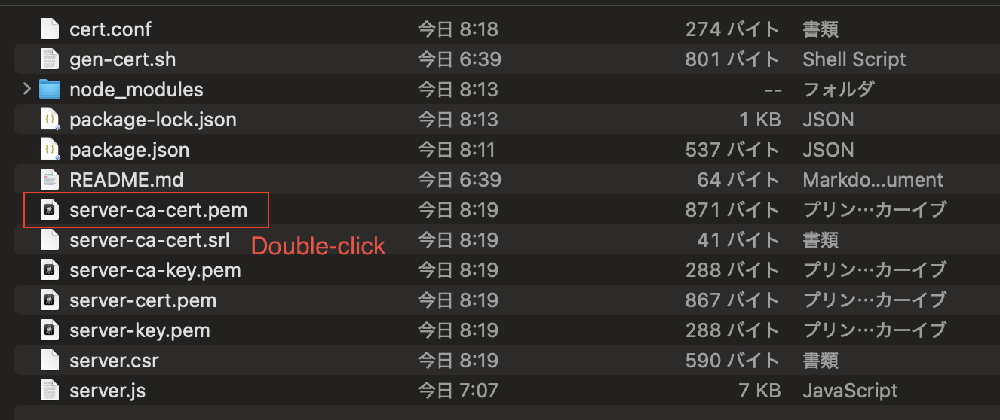
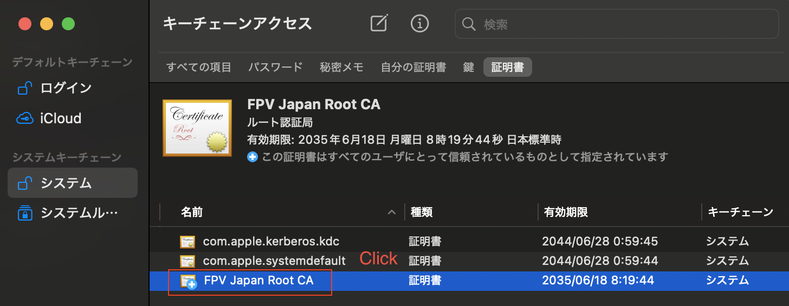
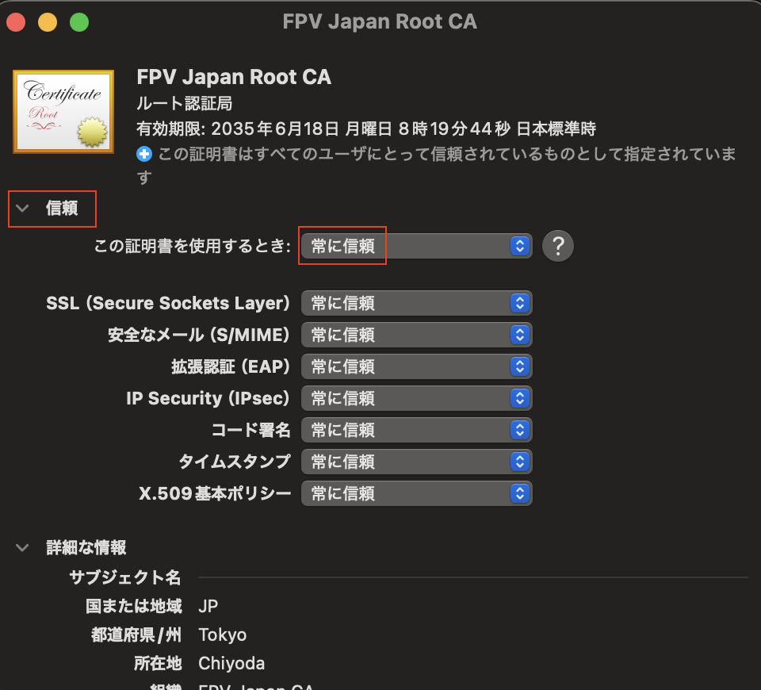

# signaling
signaling server for exchanging SDP/ICE in WebRTC

# ⚠️documentation is currently being written.


## Step1
```sh
sh gen-cert.sh
```

## Step2


## Step3


## Step4


```sh
sudo vim /etc/hosts

##
# Host Database
#
# localhost is used to configure the loopback interface
# when the system is booting.  Do not change this entry.
##
127.0.0.1	localhost vite-dev fpv-jp
#192.168.1.100 fpv-jp
```

## Step5
```sh
npm run start
```
